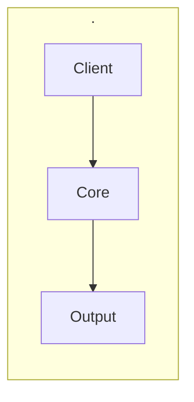

<h1 align="center">Muse</h1>

<em>**Muse is an AI-native media curation & taste companion** — a private, local-inference-first "brain" for a Plex library. It owns taste modeling, curation, metadata, availability intelligence, proactive recommendations, and a pseudo-TV channel director, backed by a **mandatory Postgres + pgvector** database, while Plex stays the playback surface and qBittorrent stays the acquisition tool.</em>

   

Docs · Quickstart · Reference · Architecture · [Changelog](CHANGELOG.md)

---

## Why MUSE

- **Muse is an AI-native media curation & taste companion** — a private, local-inference-first "brain" for a Plex library.
- It owns taste modeling, curation, metadata, availability intelligence, proactive recommendations, and a pseudo-TV channel director, backed by a **mandatory Postgres + pgvector** database, while Plex stays the playback surface and qBittorrent stays the acquisition tool.
- Muse is built **strangler-fig**: it keeps qBittorrent (acquisition) and Plex (consumption) and owns the *brain* (taste, curation, metadata, release selection, organization).
- Each phase ships independent value and *arr/Tautulli are retired one function at a time — import (the only high-blast-radius part) is dead last.
- Everything shipped so far is **Phase 0 + Phase 0.
- 5: read-only, benign playback only, zero blast radius against the live stack**.
- It is a peer to the rest of the constellation — **Harmony** (build orchestrator), **Chord** (inference proxy/orchestrator), **Terminus** (tool hub), and **Lumina** (assistant).

## Quick Start

_No quickstart content generated yet -- see Getting Started for the full tutorial._

## Architecture at a glance

It owns taste modeling, curation, metadata, availability intelligence, proactive recommendations, and a pseudo-TV channel director, backed by a **mandatory Postgres + pgvector** database, while Plex stays the playback surface and qBittorrent stays the acquisition tool. See Architecture for the full component and data-flow breakdown.

## Contributing

See the project's build pipeline docs for the contribution process.

## License

See [LICENSE](LICENSE).

## Documentation

See [the documentation index](docs/index.md) for the full reference.

- [Architecture at a glance](docs/reference/architecture-at-a-glance.md)
- [Acquisition domain schema (MUSEM-01)](docs/reference/acquisition-domain-schema-musem-01.md)
- [Running](docs/reference/running.md)
