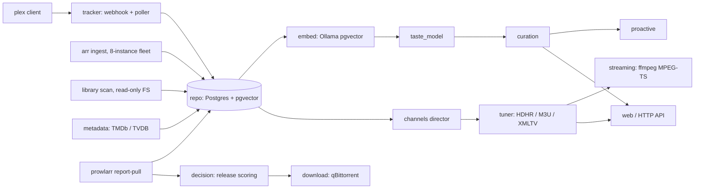

<p align="center">
  
</p>

<p align="center"><em>The Lumina Constellation's media-management module: an AI-native curation & taste brain for a Plex library — acquisition, library scan, metadata, availability intelligence, taste modeling, and a pseudo-TV channel director, backed by Postgres + pgvector.</em></p>

<p align="center">Rust · 1 binary (<code>muse</code>) · 223 modules · 3,577 KG nodes · 2,768 functions · 496 structs · 50 migrations · analyzed <code>b0112d9</code></p>

<p align="center"><a href="docs/index.md">Docs</a> · <a href="docs/getting-started.md">Getting started</a> · <a href="docs/reference/index.md">Reference</a> · <a href="docs/architecture.md">Architecture</a> · <a href="docs/guides/index.md">Guides</a></p>

---

## What is Muse

Muse is a self-hosted Rust service that owns the *brain* of a personal media stack while
leaving the existing playback and download surfaces in place: **Plex stays the playback
surface, qBittorrent stays the download tool**, and Muse sits between them. It ingests
library state from a multi-instance Radarr/Sonarr fleet, tracks playback natively
(webhook + poller — the Tautulli replacement), pulls per-indexer availability from
Prowlarr, resolves metadata across TMDb and TheTVDB, derives per-account taste profiles
from real watch behavior (pgvector embeddings via a local Ollama model), and turns all of
that into recommendations, proactive nudges, and composed pseudo-TV channels that Plex
tunes into like an HDHomeRun.

Muse is built **strangler-fig**: *arr and Tautulli are retired one function at a time,
each phase shipping independent value, with the high-blast-radius parts (library import,
writes to the live stack) deliberately last. The read paths against Plex/*arr/Prowlarr
are structurally read-only; the first write-capable path — the acquisition pipeline
(request → targeted search → release-decision scoring → qBittorrent grab) — is gated at
a single chokepoint with tiered safety classification that defaults to manual review.
Every external integration is optional and config-gated: an unconfigured client returns
`None` at startup and its features degrade gracefully instead of failing the process.

Muse is a peer of the rest of the constellation — **Harmony** (build orchestrator),
**Chord** (inference proxy; Muse routes its LLM reasoning and vision calls through
Chord's OpenAI-compatible endpoint, never a hosted model), **Terminus** (tool hub), and
**Lumina** (assistant, which consumes Muse's proactive outbox). All behavioral data —
embeddings, taste, telemetry — stays in Muse's own local Postgres; only non-personal
metadata lookups egress.

## Architecture



A fuller derived diagram, per-subsystem narrative, and the end-to-end request flow are in
[docs/architecture.md](docs/architecture.md).

## Subsystems

| Subsystem | What it does | Reference |
|---|---|---|
| `repo` | The sqlx query layer — the only place raw SQL lives (279 KG nodes, one module per table group) | [reference/repo](docs/reference/repo.md) |
| `models` | Typed rows + `New*` insert structs for the arr-shaped core schema and the telemetry/taste layer | [reference/models](docs/reference/models.md) |
| `tracker` | Native Plex playback tracker: webhook + session poller + idempotent session reconstruction | [reference/tracker](docs/reference/tracker.md) |
| `arr` | Read-only multi-instance Radarr/Sonarr ingest + tiered request-safety classification | [reference/arr](docs/reference/arr.md) |
| `prowlarr` | Polite, rate-limited indexer report-pull, release-name parsing, targeted search | [reference/prowlarr](docs/reference/prowlarr.md) |
| `metadata` | Provider-agnostic metadata seam: TheTVDB v4 client + normalized provider shape | [reference/metadata](docs/reference/metadata.md) |
| `channels` | The channel composer/director — deterministic lineups, LLM-optional rationale, named presets | [reference/channels](docs/reference/channels.md) |
| `tuner` | HDHomeRun emulation + M3U + XMLTV so Plex Live TV tunes Muse channels | [reference/tuner](docs/reference/tuner.md) |
| `snapshot` | Guarded, read-only snapshot ingestion for testing against real-shaped data | [reference/snapshot](docs/reference/snapshot.md) |
| `cultural` | The "what's hot / the talk" layer: trending ∩ library ∩ taste, cached and config-gated | [reference/cultural](docs/reference/cultural.md) |
| `discord` | Discord bot core: allowlisted friends, default-private consent, brain-driven replies | [reference/discord](docs/reference/discord.md) |
| `premiere` | Scheduled premiere events, RSVP, discussion threads, engagement-tiered request budgets | [reference/premiere](docs/reference/premiere.md) |
| `foundry` | Media formatting: transcode fabric, subtitle matcher, library organizer — **default-off**, see below | [S128 spec](specs/S128-muse-foundry.md) |

The full inventory — including `curation`, `taste_model`, `embed`, `recall`, `acquisition`,
`decision`, `download`, `library`, `matching`, `watch_together`, `taste_review`, `web`,
and the rest — is in the [reference index](docs/reference/index.md).

## Foundry (media formatting)

`foundry` is Muse's media-formatting subsystem (spec
[S128](specs/S128-muse-foundry.md)): it probes library files, judges them
against per-client direct-play profiles, and — in later phases — transcodes,
matches subtitles, and organizes folder layout. It replaces two containers in
the ARR suite that were deployed but never configured; see
[docs/ARR-SUITE-GRAPH.md](docs/ARR-SUITE-GRAPH.md) for that survey.

**Foundry is off unless you configure it, and read-only unless you also open
the mutation gate.** Both defaults are deliberate: it is the first Muse
subsystem that can delete or overwrite library files.

| Variable | Default | What it does |
|---|---|---|
| `MUSE_FOUNDRY_ALLOWED_ROOTS` | *(unset)* | `:`-separated default-deny allowlist of roots Foundry may address. **Unset means Foundry does not register at all.** Every path is resolved (symlinks included) and must land inside one of these. |
| `MUSE_FOUNDRY_ENABLE_MUTATION` | `false` | The kill-switch. While false, Foundry probes, plans and reports but cannot modify a byte. Parsed fail-closed: only `1`/`true`/`yes`/`on` open it. |
| `MUSE_FOUNDRY_WORK_DIR` | *(unset)* | Scratch for transcode output before verify-and-swap. Should be on a **different filesystem** from any allowed root; Foundry warns at startup when it is not, or when it sits inside one. |
| `MUSE_FOUNDRY_RETENTION_DAYS` | `14` | How long a superseded original stays in the Foundry recycle bin. This is an **undo window, not a backup** — it shares a filesystem with the library and it expires. |
| `MUSE_FOUNDRY_FFPROBE_BIN` | `ffprobe` | Probe binary — a `PATH` name or an absolute path. |
| `MUSE_FOUNDRY_HANDBRAKE_BIN` | `HandBrakeCLI` | Encoder binary — a `PATH` name or an absolute path. |

A configured-but-unmounted root is dropped with a warning rather than failing
startup, so an absent NFS mount degrades Foundry instead of taking down Muse.
If *no* root resolves, Foundry stays unregistered.

Nothing here is a secret, so all of it is plain configuration. Foundry's later
credentials (a subtitle-provider key, a worker-node token) are secret-shaped
and will be routed through the same redacting path as every other Muse
credential.

## Quick start

Muse is one binary with one required backing service (Postgres with pgvector):

```sh
cargo build --release            # toolchain pinned to 1.97.0 (rust-toolchain.toml)
export MUSE_DATABASE_URL=...     # Postgres DSN; migrations run at startup
./target/release/muse            # serves HTTP on MUSE_BIND_ADDR (default 0.0.0.0:8090)
```

Everything else is optional and enabled by configuration alone: `PLEX_URL`/`PLEX_TOKEN`
(playback tracking), `MUSE_ARR_INSTANCES` (library ingest), `PROWLARR_URL`/
`PROWLARR_API_KEY` (availability), `TMDB_API_KEY` + `MUSE_TVDB_API_KEY` (metadata),
`MUSE_OLLAMA_URL` (embeddings), `CHORD_URL` (LLM rationale), `MUSE_QBIT_*` (grabs),
`MUSE_API_TOKEN` (endpoint auth — protected routes answer 503 until it is set or
`MUSE_AUTH_DISABLED` is explicitly opted into). Secret values are materialized into the
environment from the vault at runtime, never authored in files.

The binary also carries three operator-only subcommands that never run at service
startup: `muse snapshot-acquire`, `muse shadow-run`, and `muse parity-report` — see the
[snapshot pipeline guide](docs/guides/snapshot-pipeline.md).

Full walkthrough: [docs/getting-started.md](docs/getting-started.md).

## Documentation

| Page | What's in it |
|---|---|
| [docs/index.md](docs/index.md) | Documentation hub and full navigation |
| [docs/architecture.md](docs/architecture.md) | Constellation position, process shape, data flows, worker inventory, module layering |
| [docs/getting-started.md](docs/getting-started.md) | Build, configure, first run, verification |
| [docs/reference/index.md](docs/reference/index.md) | Per-subsystem reference pages (12) + the full module inventory |
| [docs/guides/index.md](docs/guides/index.md) | Operator guides: Plex tuner setup, acquisition pipeline, snapshot/shadow/parity CLIs |
| [docs/schema.md](docs/schema.md) | The Postgres data model, grouped by concern |
| [docs/runbooks.md](docs/runbooks.md) | Operational runbooks |
| [docs/behavior-spec.md](docs/behavior-spec.md) | Behavioral contracts: taste derivation, ranking, proactive triggers, degradation invariants |
| [docs/EXPERIENCE_LAYER.md](docs/EXPERIENCE_LAYER.md) | The MUSEX experience layer and its opt-in-only privacy model |
| [docs/TESTING.md](docs/TESTING.md) | Test strategy: pure-function units + `MUSE_TEST_DATABASE_URL`-gated live-DB tests |

## At a glance

- **Scale:** 3,317 knowledge-graph nodes (2,554 functions, 463 structs, 72 enums, 12
  traits) across 216 modules; 8,159 intra-crate call/reference edges; 83 cross-subsystem
  edges; 47 SQL migrations.
- **Status:** foundation (S96) + media-management Sprint 1 (S119, acquisition write-path)
  + library scan/matching (S119b) are merged. Several implemented features are not yet
  production-wired — the honest inventory is
  [wiring status](docs/reference/wiring-status-what-actually-runs.md).
- **Founding specs:** [`specs/S96-muse-foundation.md`](specs/S96-muse-foundation.md),
  [`specs/S119-muse-media-management.md`](specs/S119-muse-media-management.md),
  [`specs/S119b-muse-library-scan-matching.md`](specs/S119b-muse-library-scan-matching.md).

## Contributing

Every code change goes through the constellation's spec/build pipeline (Plane ingest →
worktree → test gate → dual review → merge → verify). See the build reports in the repo
root for how prior sprints ran.

## License

[MIT](LICENSE) — Copyright (c) 2026 moosenet.
