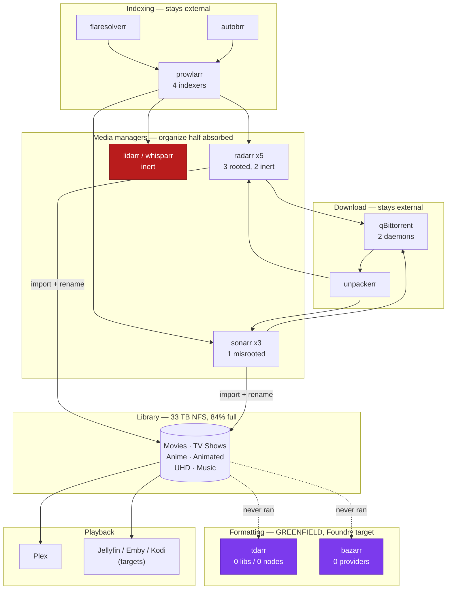

# ARR Suite Graph — the strangler-fig target map

Live survey of the operator's ARR-suite host (the Docker CT referenced by
`ARR_HOST` / `MUSE_ARR_INSTANCES`), taken 2026-07-27. This is the factual
baseline the MUSE Foundry spec (`specs/S128-muse-foundry.md`) strangles.

All hosts/IPs/keys are deliberately omitted per spec rule S1 — instances are
named by their container identity and container-internal port only. API keys
live in <secret-manager>, never here.

---

## 1. Inventory — 40 containers, 16 media-pipeline apps

### Acquisition & indexing (NOT a Foundry target)

| Container | Role | Port | State |
|---|---|---|---|
| `prowlarr` | Indexer aggregator, feeds all *arr | 9696 | 4 indexers configured |
| `flaresolverr` | Cloudflare solver for prowlarr | 8191 | up |
| `autobrr` | IRC/RSS announce filtering | 7474 | up |
| `cross-seed` | Cross-tracker seeding | — | **crash-looping** |
| `unpackerr` | Post-download archive extraction | 5656 | up |

### Media managers (*arr) — the organize/rename half is a Foundry target

| Container | Kind | Root folder | Rename | Download client |
|---|---|---|---|---|
| `radarr` | Radarr 6.1.1 | `Movies` | **on** | qBittorrent |
| `radarr_animated` | Radarr 6.1.1 | `Animated Movie` | off | qBit daemon |
| `radarr_anime` | Radarr 6.1.1 | `Anime Movie` | off | qBit daemon |
| `radarr_uhd` | Radarr 6.1.1 | *(none set)* | off | *(none)* |
| `radarr_foreign` | Radarr 6.1.1 | *(none set)* | off | *(none)* |
| `sonarr` | Sonarr 4.0.17 | `TV Shows` | off | qBittorrent |
| `sonarr_animated` | Sonarr 4.0.17 | `Animated Series` | off | qBit daemon |
| `sonarr_anime` | Sonarr 4.0.17 | **`Anime Movie`** ⚠ | off | qBit daemon |
| `lidarr` | Lidarr 3.1.0 | *(none set)* | — | *(none)* |
| `whisparr` | Whisparr 2.2.0 | *(none set)* | off | *(none)* |

⚠ **Finding A — `sonarr_anime` misconfiguration.** A *series* instance is
rooted at the *movie* library `Anime Movie`, while `Anime Series` (2,398 mkv +
322 mp4) has no series instance pointing at it. Any import through
`sonarr_anime` lands season folders inside the movie tree.

⚠ **Finding B — 4 of 10 *arr instances are inert.** `radarr_uhd`,
`radarr_foreign`, `lidarr`, `whisparr` have no root folder, no indexer and no
download client. They are running processes doing nothing.

⚠ **Finding C — renaming is off almost everywhere.** Only `radarr` has
`renameMovies: true`. Every other instance imports release-scene filenames
verbatim and never normalizes them. This is the entire reason the library has
two naming universes side by side (see §3).

### Transcode & subtitles — **the primary Foundry targets**

| Container | Role | Port | Configured state |
|---|---|---|---|
| `tdarr` | Transcode orchestrator + node fabric | 8265/8266 | **0 libraries, 0 nodes** |
| `bazarr` | Subtitle matcher/downloader | 6767 | **0 providers, sonarr/radarr integration OFF, 0 path mappings** |

**Finding D — both strangler targets are greenfield.** Tdarr v2.70.01 is
running with no library and no worker node registered; Bazarr is running with
`enabled_providers: []`, `use_sonarr: false`, `use_radarr: false`. Neither has
ever done work. There is **no live behavior to preserve and no migration
risk** — Foundry replaces two inert services, not two working ones.

### Presentation / request / analytics (already MUSE-covered)

| Container | Role | MUSE coverage |
|---|---|---|
| `<media-service>` | Request front-end | MUSEM acquisition sprint (S119) |
| `tautulli` | Plex analytics | `src/tautulli` |
| `recyclarr` | TRaSH quality-profile sync | → Foundry policy engine |
| `notifiarr` | Notification fan-out | Lumina/assistant layer |
| `tunarr` | Live-channel generator | `src/tuner` (MUSE-28/29) |

### Non-media (out of scope entirely)

`wger` + `wger-db` + `wger-redis`, `grocy`, `homebox`, `calibre`,
`calibre-web`, `audiobookshelf`, `mylar3`, `immich_db`, `immich_redis`,
`pathfinder` + `pathfinder-containers-pfdb-1` + `socket`, `wizarr`,
`dispatcharr`, `redis`, `portainer_edge_agent`.

---

## 2. Dataflow graph



---

## 3. Library reality — what actually needs formatting

Extension census over five libraries (file counts):

| Library | mkv | mp4 | avi | wmv | m2ts | ass | srt |
|---|---|---|---|---|---|---|---|
| Movies | 1607 | 147 | 124 | — | — | — | 133 |
| TV Shows | 5965 | 353 | **1928** | — | — | — | 552 |
| Anime Series | 2398 | 322 | 7 | **22** | — | 203 | — |
| Animated Movie | 110 | 20 | 31 | — | **21** | — | — |
| Movies UHD | 11 | — | — | — | — | — | — |

**Note on `.7z`/`.rar`.** These dominate raw file counts (3,816 `.7z` in
Movies) but are **1–5 KB compressed `.nfo`/`.sfv` scene-metadata stubs**, not
un-extracted media archives. They are organizer *junk-classification* input,
not transcode input. (An earlier read of this census as "un-extracted archive
debris" was wrong; the file sizes disprove it.)

**Real transcode backlog ≈ 2,150 legacy-container files** (1,928 avi + 22 wmv
+ 21 m2ts + ~180 assorted), plus an unmeasured tail of HEVC/10-bit and
lossless-audio files whose direct-play status is client-dependent.

### Measured codec baseline (sandbox samples)

| Sample | Container | Video | Audio | Subs | Direct-play verdict |
|---|---|---|---|---|---|
| DVD-rip TV | avi | `msmpeg4v3` 512×384 | ac3 2.0 | — | **fails on all four clients** |
| Anime SDTV | asf/wmv | `wmv3` 720×480 | wmav2, lang `swe` ⚠ | — | **fails on all four**; language tag also wrong |
| BluRay stream | m2ts | `mpeg2video` 1080p | `pcm_bluray` 5.1 @ 4.6 Mb/s | — | **fails**; 25 Mb/s for 1080p |
| Anime dub | mp4 | h264 High 720p | aac-lc 2.0 | — | direct-plays everywhere |
| Modern TV | mkv | `hevc` Main | aac-lc 2.0 | ass (embedded) | client-dependent; ASS burns on some |
| Modern film | mkv | h264 High 1080p | ac3 5.1 | subrip | direct-plays everywhere |

**Finding E — a language tag worth a second look, not an automatic rewrite.**
The `wmv3` sample tags its audio `swe`. That *may* be wrong — the series is an
English dub — and if it is, Jellyfin/Emby language selection trusts the tag and
the track becomes unselectable by an English-preferring profile. But `swe` is a
valid ISO 639-2 code and nothing in the probe establishes what the audio
actually is. An earlier version of this note called it "mislabeled" and
concluded metadata repair should be a first-class Foundry function; that
overstated the evidence. Foundry reports a tag as *suspected*-wrong only with a
corroborating source (release name, a sibling track, an `und` tag) and never
rewrites one automatically — see `specs/S128-muse-foundry.md` MUSEF-15.

---

## 4. Coverage arithmetic — what "strangler figged" actually means

**Counting rule (stated because the first draft of this section was wrong):**
one row per *distinct application*, not per running container. The five Radarr
containers are one app; the three Sonarr containers are one app. Non-media
containers (§1, "Non-media") are excluded. Plex and qBittorrent are excluded
because they are not ARR-suite apps — they are the playback server and the
download client the suite drives. That rule yields **16** apps: 5
acquisition/indexing + 4 media managers + 2 transcode/subtitle + 5
presentation/request/analytics.

| # | App | Post-Foundry status |
|---|---|---|
| 1 | `tdarr` | **Replaced** by Foundry (Forge + Fabric) |
| 2 | `bazarr` | **Replaced** by Foundry (Lexicon) |
| 3 | `recyclarr` | **Replaced** by Foundry's policy engine |
| 4 | `<media-service>` | Already MUSE (MUSEM acquisition, S119) |
| 5 | `tautulli` | Already MUSE (`src/tautulli`) |
| 6 | `tunarr` | Already MUSE (`src/tuner`, MUSE-28/29) |
| 7 | `radarr` ×5 | **Split** — organize/rename → Foundry; acquisition stays |
| 8 | `sonarr` ×3 | **Split** — organize/rename → Foundry; acquisition stays |
| 9 | `prowlarr` | External. Muse consumes its reports read-only; indexing stays |
| 10 | `flaresolverr` | External (prowlarr's captcha solver) |
| 11 | `autobrr` | External (IRC/RSS announce filtering) |
| 12 | `cross-seed` | External (currently crash-looping) |
| 13 | `unpackerr` | External — genuine archive extraction is a documented follow-up, **not** in this spec |
| 14 | `notifiarr` | External to Muse; notification belongs to the assistant layer |
| 15 | `lidarr` | Out of scope (music); currently inert |
| 16 | `whisparr` | Out of scope; currently inert |

**Honest totals: 6 of 16 fully replaced or already owned, plus 2 more
partially absorbed — so 8 of 16 (50%) are touched at all, and 37.5% are fully
superseded.**

An earlier draft of this section claimed "12 of 16 (75%)". That was wrong and
is corrected here: it double-counted `prowlarr` in two columns, counted `plex`
and `qBittorrent` which are not ARR-suite apps, and listed `unpackerr` as
absorbed when the spec explicitly defers extraction. The real figure is lower,
and the difference matters for planning — Foundry replaces the *formatting*
layer decisively, but the acquisition and indexing layers survive largely
intact and were never a target.

The *arr instances are not decommissioned by Foundry: their acquisition half
(monitoring, indexer search, grabbing) stays; only their organize/rename half
is superseded. Decommissioning `tdarr`, `bazarr` and `recyclarr` outright is
safe today because none of the three is configured.

---

## 5. Hazards Foundry must respect

1. **Hardlinks / active seeding.** `radarr_foreign`, `radarr_uhd`, `lidarr`
   and `whisparr` set `copyUsingHardlinks: true`, and the downloads volume is
   a separate device from the library — so a hardlink may or may not exist
   depending on instance and path. Replacing a hardlinked, actively-seeded
   file breaks the torrent. Foundry MUST detect `st_nlink > 1` and **refuse —
   block the file and leave it completely untouched.** Copy-on-write is *not*
   an acceptable alternative: for an organizer it still removes the
   torrent-known source path, and clients track content by path, not inode.
   Note also the converse: `st_nlink == 1` does **not** prove a file is
   unseeded, so this check is a floor, not a guarantee (see
   `specs/S128-muse-foundry.md`, "The content-preservation invariant").
2. **No recycle bin anywhere.** Every *arr instance has `recycleBin: ""`.
   There is no undo today. Foundry supplies its own retention.
3. **Library is 84% full (27 TB used of 33 TB).** A transcode pass that writes
   before deleting needs headroom accounting; the work directory must be on a
   different device from the library.
4. **NFS library, permissions `nobody:nogroup`.** Atomic rename works within
   the mount but not across it; `setPermissionsLinux: false` fleet-wide.
5. **GPU is a shared, Chord-arbitrated pool.** Foundry must lease GPU through
   Chord's control API, never assume the device is free.

---

## 6. Dev sandbox (live)

A mutation-safe sandbox is provisioned on the ARR host's local download volume
(`MUSE_FOUNDRY_SANDBOX_ROOT`), on a **different physical device from the NFS
library**, 277 GB free:

```
<sandbox>/
  src-readonly/   6 samples: avi(msmpeg4v3) wmv(wmv3) m2ts(mpeg2/pcm)
                  mp4(h264/aac) mkv(hevc/aac/ass) — 5.6 GB
  staging/        one intact scene release dir (mkv + nfo + nfo.7z + poster
                  + READ_ME) — organizer/junk-classification fixture
  library/        organizer output target
  work/           transcode scratch
  cache/          node cache
  subs/           subtitle output
```

**Proven end-to-end 2026-07-27:** `HandBrakeCLI` (from the tdarr image, with
`jellyfin-ffmpeg` alongside) transcoded the 41-minute `msmpeg4v3` DVD-rip to
h264/mkv with audio passthrough in **54.7 s (≈45× realtime, CPU x264
veryfast)**, 367 MB → 245 MB (−33%), and the source file on the NFS library was
verified byte-identical and untouched.
