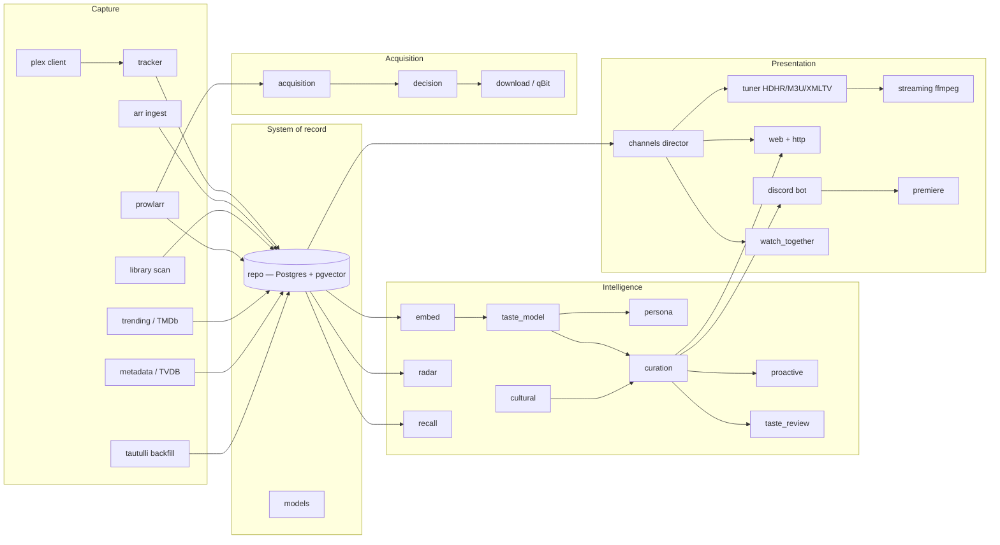

# Muse — Architecture

This document describes where Muse sits in the constellation, how data flows through it,
and how its modules layer. It is grounded in the shipped code (`src/`, `migrations/`),
not the aspirational founding spec. For the data model see [schema.md](schema.md); for
operations see [runbooks.md](runbooks.md); for behavioral contracts see
[behavior-spec.md](behavior-spec.md); for per-subsystem detail see the
[reference pages](reference/index.md).

## 1. Constellation position

Muse is a **standalone Rust service** and a first-class peer of the other constellation
services, not a plugin of any of them:

- **Harmony** — the build orchestrator; it builds Muse through the spec pipeline.
- **Chord** — the inference proxy/orchestrator. Muse routes its *reasoning* calls
  (curation rationale, taste `model_notes`, optional channel-lineup composition, the
  matching-verification vision check) through Chord's OpenAI-compatible
  `/v1/chat/completions` surface to a local model. Muse never talks to a hosted LLM.
- **Terminus** — the tool hub. Terminus's `media_*` tools are the voice/tool surface and
  re-point at Muse as phases land. **Muse does not call Terminus MCP tools in-process** —
  where it needs a fleet capability (SearXNG, news search, the taste-finding sink) it
  calls a configured HTTP endpoint directly.
- **Lumina** — the assistant. Lumina's scheduler polls Muse's `GET /proactive/pending`
  surface and relays nudges. Muse is the brain; Lumina is the voice.

Muse keeps **qBittorrent** (downloads) and **Plex** (consumption) in place and owns the
brain in between. Postgres + pgvector is Muse's own **system of record** — taste,
telemetry, embeddings, and availability all live there, on-LAN. Only non-personal
metadata lookups (TMDb, TheTVDB, Trakt, web sentiment) egress; embeddings and all
behavioral data stay local.

## 2. Subsystem map

Derived from the crate's knowledge graph (3,317 nodes, 83 cross-subsystem edges):



The `snapshot`/`shadow`/`parity` subsystems sit deliberately outside this runtime graph:
they run only via operator CLI subcommands against a guarded, isolated database (see
[reference/snapshot](reference/snapshot.md)).

## 3. Process shape

A single `axum` HTTP server (`muse` binary, default bind `0.0.0.0:8090`) plus background
workers, all over an `sqlx` Postgres pool. Startup (`src/main.rs`):

1. Argv gate: `muse snapshot-acquire`, `muse shadow-run`, and `muse parity-report` are
   operator-only subcommands that return before any server bootstrap — they can never run
   as part of normal service startup.
2. `Config::from_env()` — every setting read from the environment (vault-materialized;
   `src/config.rs` is the one central place secret-shaped env vars are read).
3. Build a **lazy** Postgres pool — a missing/unreachable DB never blocks startup.
4. Construct the optional upstream clients: `PlexClient`, `ProwlarrClient`, the *arr
   fleet, `TmdbClient`, `OllamaEmbedClient`, `EnrichmentService`, `QbitClient`. Each
   `from_config` returns `None`/empty when unconfigured (logged at boot so
   misconfiguration is visible).
5. Assemble `AppState` (pool + config + those clients), shared behind `Arc`.
6. Best-effort migrations (`db::migrate`) — logged and continued if the DB is down.
7. `workers::spawn_workers(state)` — spawn the background workers (§6).
8. Serve the router (`http::router`), with `http::auth::require_api_token` applied to
   the protected route group only (fail-closed: no `MUSE_API_TOKEN` → protected routes
   answer 503 unless `MUSE_AUTH_DISABLED` is explicitly set).

Errors flow through the crate `MuseError` enum (`src/error.rs`), whose `IntoResponse`
maps each variant to a status: `Database`/`Config`/`Internal` → 500, `NotFound` → 404,
`BadRequest` → 400, `Conflict` → 409, `NotImplemented` → 501, `Http`/`Upstream` → 502,
`ServiceUnavailable` → 503. Every error body is `{"error": message}`.

## 4. Data flows

### 4.1 Ingest → telemetry → taste → recall → curation → proactive

```
 Radarr/Sonarr ──(arr::ingest)──►  media_metadata / media_items / seasons / episodes / media_files
 Plex webhook ──POST /ingest/plex-webhook──►  play_events ──┐
 Plex /status/sessions ──(tracker::poller)──►  play_events ─┤
 Tautulli ──(tautulli::backfill, SEAM)──►  play_sessions ───┤
                                                            ▼
                        tracker::reconstruct  ──►  play_sessions (+ media_info)
                                                            │
                        (watch_stats / ratings / watchlist derived)
                                                            ▼
   embed::embed_stale ──nomic-embed-text──►  embeddings (pgvector, HNSW)
   taste_model::recompute ──►  taste_signals → taste_profile + taste_context_centroids
                                                            │
        recall (/query/*) ◄──embed::nearest──────────────  embeddings
        curation (/recommend*) ◄──taste_profile + watch_stats + availability──
                                                            ▼
   proactive::generators ──(worker, hourly)──►  proactive_items ──GET /proactive/pending──►  Lumina
```

The telemetry core (`play_events` → `play_sessions`) is the Tautulli-equivalent;
everything downstream reads from it. Since MUSE-31, the **maintenance worker** runs the
previously-uncalled write-path routines on a schedule — one dependency-ordered pass per
`MUSE_MAINTENANCE_TICK_SECS` (default 30 min): arr ingest → `embed_stale` → per-account
taste/divergence recompute → bounded enrichment. `tautulli::backfill` remains a
manually-invoked seam.

### 4.2 Availability report-pull (Prowlarr)

```
 Prowlarr /api/v1/indexer ──►  indexers
 Prowlarr /api/v1/search (RSS mode, per indexer) ──►  releases (deterministic name-parse) ──►  availability rollup
```

The report-pull worker (`prowlarr::worker`, spawned only when Prowlarr is configured)
wakes every `MUSE_PROWLARR_TICK_INTERVAL_SECS` and, for each enabled indexer that is due
(per its own DB-backed `polite_min_interval_secs`), performs an RSS-mode pull, parses
each release name deterministically, upserts into `releases`, resolves confident matches
to a `media_metadata` title (threshold: `MUSE_PROWLARR_RESOLVE_MIN_CONFIDENCE`),
recomputes the per-title `availability` rollup, and prunes expired rows. A pull is not a
grab. Availability feeds curation and the `grab_window` proactive generator.

### 4.3 The acquisition write-path (how a media request flows)

The S119 Sprint-1 pipeline — Muse's first write to an acquisition substrate, gated at a
single chokepoint:

```
 POST /requests (http::requests, token-protected)
   │
   ▼
 acquisition::fulfill_request
   1. prowlarr::search::search_releases      — bounded on-demand targeted search (MUSEM-03)
   2. arr::request::classify_tier            — tiered safety gate (MUSEX-14): AutoApprovable /
      │                                        NeedsReview / Blocked; auto-tier is OFF by default
      │                                        (MUSE_ARR_REQUEST_AUTO_TIER_ENABLED=false)
   3. decision::decide_release               — pure scoring over quality profile + custom
      │                                        formats + parsed release attributes (MUSEM-04)
   4. download::qbit::QbitClient::add        — the grab (MUSEM-02); degrades to "persisted
      │                                        but unfulfilled" when qBittorrent unconfigured
      ▼
 repo::acquisition — media_requests + monitored_items rows record the lifecycle
```

`acquisition::worker::run_wanted_pass` (MUSEM-06) drives the same pipeline for monitored
"wanted" items on the maintenance cadence, bounded by per-pass grab/search caps and a
per-item cooldown so a fresh wanted list can never become an unbounded burst. Engagement
tiers (`premiere::engagement`) can *shrink* a friend's request budget, never bypass the
gate.

### 4.4 Channels: compose → schedule → tune → stream

```
 (on-demand)  channels::compose / channels::director ──►  channel_runs + channel_programs
 (linear)     tuner::scheduler (worker) ──rolling grid──►  channel_programs
                                                            │
              tuner: /discover.json /lineup.json /muse.m3u /xmltv.xml  ◄── Plex reads this as a custom tuner
                                                            ▼
              streaming: GET /auto/v{id}  ──onnow──►  ffmpeg (stream-copy, join-mid-stream)  ──►  MPEG-TS
              web: / /guide /api/channels /art  ──►  browser EPG (Plex token never leaves the server)
```

Two channel modes share the same `channels`/`interstitials` tables but different
composers: `mode='on_demand'` uses the LLM-optional `channels::compose` director (fully
deterministic without Chord; any LLM failure falls back to the deterministic order plus a
templated rationale); `mode='linear'` is fed by `tuner::scheduler`, a deterministic
round-robin grid-filler that keeps `channel_programs` topped off a rolling
`MUSE_CHANNEL_GUIDE_WINDOW_HOURS` ahead. The tuner routes and the ffmpeg streaming engine
are fully live.

## 5. Per-subsystem narrative

- **Foundation** — `config` (the one env-reading module; secrets wrapped so `Debug` can't
  leak them), `error`, `db`, [`models`](reference/models.md) (typed rows),
  [`repo`](reference/repo.md) (the only raw-SQL layer, runtime sqlx so the crate builds
  without a live DB).
- **Capture** — [`tracker`](reference/tracker.md) (native Plex tracker: webhook + poller
  + one idempotent reconstruction fold + pattern interpretation),
  [`arr`](reference/arr.md) (read-only 8-instance fleet ingest),
  [`prowlarr`](reference/prowlarr.md) (polite report-pull + targeted search), `plex`
  (typed read-only client), `library` (read-only filesystem scan that only matches
  *existing* titles), [`metadata`](reference/metadata.md) (provider-agnostic seam; TVDB
  v4 client), `trending` (TMDb trending/popular/providers ingest), `tautulli` (backfill
  seam), `enrichment` (sentiment/news via configured HTTP endpoints).
- **Intelligence** — `embed` (local Ollama `nomic-embed-text` → pgvector), `recall`
  (vector → trigram → optional-TMDb resolution ladder), `taste_model` (auditable
  signal-weighted profile derivation), `persona` (latent taste personas as views over the
  same embeddings), `radar` (you-vs-population divergence), `curation`
  (candidates + fact-grounded rationale), [`cultural`](reference/cultural.md) (trending ∩
  library ∩ taste), `proactive` (generators + outbox), `taste_review` (adversarial
  "right answer, wrong reason" panel), `adaptation`, `promotion`, `kg` (watch-history /
  group-dynamics graph).
- **Acquisition** — `acquisition` (the orchestrator), `decision` (pure release scoring),
  `download` (the qBittorrent adapter behind a trait seam), `matching` (still-frame
  extraction + liveness + vision verification of library matches).
- **Presentation / social** — [`channels`](reference/channels.md),
  [`tuner`](reference/tuner.md), `streaming`, `web` + `http`,
  [`discord`](reference/discord.md), [`premiere`](reference/premiere.md),
  `watch_together`, `conversational`, `assistant`, `settings`, `plex_control`.
- **Test-only isolation** — [`snapshot`](reference/snapshot.md) + `shadow` + `parity`:
  guarded ingestion of real-shaped data into an isolated DB, the shadow Tautulli-
  replacement analytics run, and the retirement-readiness parity report.

## 6. Background workers (`src/workers.rs`)

| Worker | Cadence (env) | Spawn condition |
|---|---|---|
| `tracker::poller` | `MUSE_PLEX_POLL_SECS` (default 10s) | always; no-ops if Plex unconfigured |
| `prowlarr::spawn_report_pull_worker` | `MUSE_PROWLARR_TICK_INTERVAL_SECS` (60s) | only if Prowlarr configured |
| `tuner::scheduler` | `MUSE_CHANNEL_SCHEDULER_TICK_SECS` (900s) | always; no-op with zero linear channels |
| `proactive::scheduler` | `MUSE_PROACTIVE_TICK_INTERVAL_SECS` (3600s) | always; first tick skipped after restart |
| `maintenance` worker | `MUSE_MAINTENANCE_TICK_SECS` (1800s) | always; each step degrades independently |
| `trending` worker | `MUSE_TRENDING_TICK_SECS` (86400s) | always; no-op when TMDb unconfigured |

Promotion sweeps (`MUSE_PROMOTION_CADENCE_SECS`) and premiere announces
(`MUSE_PREMIERE_ANNOUNCE_CADENCE_SECS`) have tunables but **no scheduled driver yet** —
documented follow-ups, not wired workers.

## 7. Module dependency layering

Roughly bottom-up (each layer depends only on those below it):

1. **Foundation** — `config`, `error`, `db`, `models/*`, `repo/*`.
2. **Upstream clients** — `plex`, `arr::client`, `prowlarr::client`, `trending::client`,
   `metadata::tvdb`, `embed::ollama`, `taste_model::chord_client`, `enrichment::client`,
   `download::qbit`, `plex_control::client`. All typed, `from_config`-constructed,
   graceful-degrading.
3. **Ingest / capture** — `arr::ingest`, `tracker`, `library::scan`,
   `tautulli::backfill`, `prowlarr::worker`, `trending`.
4. **Intelligence** — `embed::pipeline`, `recall`, `taste_model`, `persona`,
   `radar::divergence`, `curation`, `cultural`, `proactive`, `taste_review`,
   `enrichment`, `kg`.
5. **Acquisition** — `prowlarr::search` → `decision` → `download` orchestrated by
   `acquisition`; `matching` verifies what landed.
6. **Presentation / control** — `channels`, `tuner`, `streaming`, `web`, `discord`,
   `premiere`, `watch_together`, `plex_control`.
7. **HTTP + workers** — `http::router` + `AppState` wire the live handlers;
   `workers::spawn_workers` wires the live workers; `main` assembles everything.

The `repo` layer is the only place raw SQL lives; every other module composes `repo`
functions. Pure computation (name parsing, taste weights, radar formulas, reconstruction
folds, lineup building, release scoring) is deliberately separated from I/O so it is
unit-testable without a database — live-DB tests cover the persistence round-trips (all
gated on `MUSE_TEST_DATABASE_URL`).
