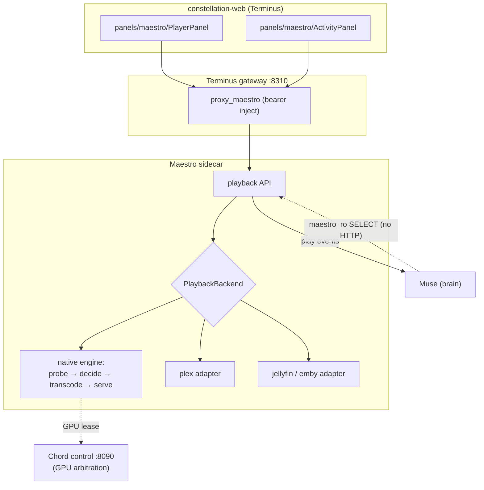

# S130 — Maestro: the Constellation playback engine (EPIC)

plane_project: MUSE
module: Muse
prefix: MSTR
spec_id: S130-maestro-epic

## Metadata
- **Author:** Moose
- **Session:** S130
- **Date:** 2026-08-01
- **Module version:** Muse v0.1 → Maestro v0.1 (new module)
- **Estimated total:** ~6–9 sprints across 12 child specs (A–L)
- **North-Star layer:** module
- **Module-Contract:** meets §4 clauses 1–7 (see §9)
- **Context:** Muse today is a media *brain* that leaves playback to Plex. This epic gives the
  Constellation its own playback engine — **Maestro** — as a crash-isolated sidecar binary in the
  Muse repo, while keeping Muse able to drive an existing Plex server instead. Superseded design
  review: `S130-muse-native-playback-engine.md`.
- **Revision note:** this epic was revised three times during authoring — for the same-repo
  correction (§2), then twice against architectural review. Most consequentially, the local
  checkout was found to be **64 commits stale**, which had hidden the fact that Foundry's probe and
  plan engines are **already built** (§2b). Child specs written before those revisions carry
  correction notes; where a child spec and this epic disagree, **the epic wins**.

---

## 1. What Maestro is

**Maestro is a playback abstraction first and a media server second.** That ordering is the
single most important decision in this epic, and everything else follows from it.

Maestro exposes one playback API to the Constellation. Behind it sit interchangeable backends:

| Backend | What it is | When |
|---|---|---|
| `plex` | Drives the existing Plex server — **control + observe only, no bytes** (§8.6) | Phase 1 — already live in the household |
| `native` | **Maestro's own engine** — probe, decide, transcode, segment, serve | Phases 2–5 |
| `jellyfin` / `emby` | Same trait, written when a server exists to test against | **Deferred** (§8.5) |

**Why this ordering wins.** The Server Activity section and the *remote-control* half of the Player
can ship and be genuinely useful against Plex before a single line of transcoding exists. When the
native engine lands it swaps in behind the same trait with no client change. The alternative —
build the transcoder first, then a GUI — leaves months of work invisible and unvalidated. It also
means the household never loses playback during the migration, which is what makes a strangler-fig
approach possible here at all.

**Read this claim precisely, because an earlier draft overstated it.** In `plex` mode Maestro
controls and observes; it does **not** serve bytes, so there is no in-browser video for Plex content
(§8.6). "Genuinely useful against Plex" means *remote control and visibility*, not a web player.
In-browser playback arrives with the native engine in spec D.

This also satisfies the user-facing requirement directly: **Muse integrates with an existing media
server OR is one.** That is not a compromise position, it is the architecture.

---

## 2. Why a separate binary — but the SAME repo (the crash-isolation requirement)

**Maestro is a second binary inside the existing `moosenet/Muse` repo. It is NOT a new repo.**
Crash isolation is a *process* boundary, not a *repository* boundary — and buying it with a new repo
would cost a second Gitea repo, a second GitHub mirror, a second updater module, a second CI config,
and a permanent risk of type skew between Muse's and Maestro's idea of a media item, for no
isolation we do not already get from a separate process.

Concretely:

- **One crate, two `[[bin]]` targets.** `muse` (existing) and `maestro` (new,
  `src/bin/maestro/main.rs`), with Maestro's modules under `src/maestro/`. Shared `models/`,
  `config.rs`, `repo/`, `error.rs` — no duplication, no version skew, one `Cargo.lock`.
- **Two processes, two systemd units, two cgroups.** This is where the isolation actually comes
  from. A wedged or OOM-killed ffmpeg takes down `maestro.service` and nothing else; the taste
  brain, acquisition pipeline, proactive outbox, and linear-channel tuner keep running.
- **One OCI image, two bins.** The publish path already supports this —
  `oci-publish.sh muse moosenet/Muse main muse maestro` packages both under `/bins/`, and
  `OCI_INSTALL=( "muse:/opt/muse/muse:muse.service" "maestro:/opt/muse/maestro:maestro.service" )`
  deploys both all-or-nothing with a shared rollback. One review pipeline, one mirror, one KG.

**Runtime data path — one authoritative design, stated once (review found this contradicted across
four sections).** Elsewhere this document has described item resolution both as a direct read-only
database query *and* as an HTTP "Muse item-resolution API". Those are not alternatives to be chosen
per child spec — they are two halves of one design, and stating them loosely invited incompatible
implementations. The settled version:

- **The `BackendMediaRef` type is the contract.** It is what resolution returns —
  `FilePath{path, media_info} | PlexRatingKey(..) | JellyfinItemId(..)`.
- **The transport is a direct `maestro_ro` query** through `muse_core::library_view`. There is **no
  HTTP call on the playback hot path**; an HTTP hop to learn a file path on every playback would be
  latency for nothing.
- **`MAESTRO_MUSE_TOKEN` is therefore NOT for resolution.** It authenticates the *other* direction —
  Maestro → Muse **play-event delivery**, which genuinely is HTTP so that Muse remains the single
  writer of watch state.

Maestro **writes nothing** to library tables. Sharing a repo must not become sharing ownership.

**Resource posture.** Maestro is the only Constellation component that holds CPU — and optionally
GPU — for minutes at a time. It gets its own cgroup caps, its own metrics, and its own seat in
Chord's arbitration. Because ffmpeg stays a *subprocess* (§7.1), Maestro links no media libraries
and the shared image keeps its musl-static default.

**Ownership split:**

| Concern | Owner |
|---|---|
| Library, metadata, taste, curation, acquisition, channels, requests | **Muse** |
| **Probe execution + storage** (`media_files.media_info`) | **Muse** — a library *fact*, needed by Foundry, quality scoring and taste regardless of playback |
| **Shared media core** — `MediaProbe` + the ffprobe parser | **`src/media/`**, consumed by BOTH Maestro (play time) and Foundry (curation time). See §2b. |
| **TWO planners, deliberately distinct — not one shared `plan()`** | `foundry::plan_transcode(&MediaProbe, &TranscodePolicy)` answers *"re-encode this file permanently?"* (curation, **stays Foundry's**). `media::decision::plan(&[MediaProbe], &DeviceProfile, …)` answers *"can this device play this now?"* (playback, **spec C's**). They share `MediaProbe` and lower-level vocabulary, **never a `plan()` contract.** An earlier draft listed a single shared `plan()`; that was wrong and invited the duplication §2b exists to prevent. |
| Playback decision *application*, transcode, segment delivery, playback sessions | **Maestro** |
| Playback events → watch history → taste | Maestro **emits**, Muse **consumes and remains authoritative** |
| Library scan, metadata providers, artwork, titles | **Muse only.** Maestro must never grow any of them. |

The failure mode this prevents is dual library ownership — two scanners, two metadata caches, two
watch-state stores that silently drift. Because the taste model sits downstream of watch state,
drift there corrupts recommendations rather than merely looking untidy.

**Enforce this structurally, not socially.** "Reject it in review" is not a mechanism; reviews
forget. Ranked by strength, cheapest-first:

1. **A Postgres privilege model with TWO roles — do this first, in spec B.** An earlier draft named
   only `maestro_ro` and was **wrong**: Maestro owns its session table and its event outbox, so a
   SELECT-only DSN cannot work. The corrected model, which spec D already implements:
   - **`maestro_ro`** — `SELECT` **only** on `media_items`, `media_files`, `accounts`. Critically,
     **no SELECT at all on the taste, embedding or play-event tables** — that enforces
     read-*scope*, not merely read-only, so Maestro physically cannot become taste-aware.
   - **`maestro_rw`** — `SELECT`, `INSERT`, `UPDATE`, `DELETE` on **only** `playback_sessions` and
     `maestro_event_outbox`, and on nothing else. No grant on any library table, ever.
     **`SELECT` is included deliberately** — an earlier draft granted only the write verbs, which
     was a runtime-fatal error caught in review: `maestro_ro` cannot read these tables either, so
     session retrieval and outbox polling would both have failed at the first query. A role that
     owns a table must be able to read it.
   - **`browser_account_map`** (§8.1) — `SELECT` to `maestro_ro`. Maestro *resolves* an account
     through it and never mutates it; the mapping is operator-managed, so **no role gets write.**
     Called out explicitly because an earlier draft introduced the table without granting any role
     access to it, which would have failed at runtime rather than review.

   Both DSNs via <secret-manager>, plus a startup assertion using `has_table_privilege()` that fails fast
   if either grant drifts — including a **negative** assertion that the write role cannot touch
   library tables. **This is the only mechanism that constrains code nobody has written yet.**
2. **A Cargo workspace split — the compile-time answer, and far cheaper than a repo split.** Still
   **one repo, one `Cargo.lock`, one OCI image, one mirror, one KG** — everything the same-repo
   decision bought is preserved. The crate graph becomes `crates/muse-core` (errors, models,
   `src/media/`, a narrow read-only library view), `crates/muse`, `crates/maestro`, and
   **`crates/maestro` simply does not depend on the crate containing `library::scan`, `metadata::*`,
   or the repo write functions.** A PR that gives Maestro a scanner *does not compile* without a
   `Cargo.toml` diff no reviewer can miss.

   **Sequencing (corrected — an earlier draft deferred this too far).** A and B may begin as
   `src/maestro/` plus a second `[[bin]]`, **but the workspace split is a hard prerequisite for the
   first Maestro code that touches persistence** — not merely "before spec D". Until it lands,
   Maestro sits in the same crate as the repo write functions and the boundary is convention only.
   So during that window this section claims **less**: the DB roles are the enforcement, and the
   crate graph is not yet doing any work. Do not cite structural enforcement for a property only a
   later refactor will provide.
3. **A narrow library-view module** — `muse_core::library_view::{resolve_playback_file, media_info}`
   over the `maestro_ro` pool, as the *only* query surface Maestro code touches. Trivially greppable.
4. **CI lint as a backstop — and only ever a backstop** (~30 lines, same pattern as
   `lint:adherence`): fail if `crates/maestro/**` matches `use .*::repo::` outside the view,
   contains `INSERT|UPDATE|DELETE` in any sqlx string, or points an HTTP client at a
   metadata-provider host.
   **Its weakness is stated deliberately, because review flagged it as overclaimed:** a regex over
   source is bypassable by lowercase SQL, a query builder, a helper function, an alias, a transitive
   call, or simply a new query location. It catches the careless case and the "helpful refactor",
   which is worth ~30 lines — **it does not constrain a determined implementer, and must never be
   cited as the reason a boundary holds.** The DB grants (#1) are the mechanism; this is a tripwire.
5. **Schema rule** — Maestro's tables carry no textual-metadata columns: no `title`, `poster`,
   `overview`, `year`. Payloads reference `muse_item_id` only.
6. **Two proxies in the GUI** — the Player panel gets metadata and artwork via `proxy_muse`,
   transport via `proxy_maestro`. The client composition itself encodes the split.

**Rejected as theatre: module privacy alone.** Rust cannot express "visible to every module except
`maestro`"; anything `pub` in a shared crate is reachable, and the repo write functions must stay
`pub` for Muse's own modules.

**Config isolation.** `MaestroConfig` is its own struct parsed from its own env vars, sharing only
the vault machinery. **Do not hand Maestro the whole Muse `Config`** — it carries TMDb, TVDB,
qBittorrent and Discord credentials whose mere reachability invites exactly the coupling this
section forbids.

### 2b. Reconciliation with Foundry — MUSEF-02 IS ALREADY BUILT

⚠️ **This section was rewritten 2026-08-01 after fast-forwarding the local checkout 64 commits to
`origin/main` (`e8499aa`). The earlier version of this epic — and the first drafts of specs A and C —
were written against a stale tree and materially understated what already exists.**

**Foundry's MUSEF-02 is not a scoped-but-unbuilt spec item. It is ~8,200 lines of shipped,
well-designed code on `main`:**

| File | Lines | What it already provides |
|---|---|---|
| `src/foundry/probe.rs` | 948 | **The ffprobe wrapper + a pure parser**, with `MediaProbe`, `VideoStream`, `AudioStream`, `SubtitleStream`, `AttachmentStream`, `ProbeError` |
| `src/foundry/plan.rs` | 1,435 | **`plan_transcode(&MediaProbe, &TranscodePolicy) -> TranscodePlan`** — a total, pure function with `TranscodeDecision`, `VideoAction`, `AudioAction`, structured `TranscodeReason`, and an explicit `Undecidable` |
| `src/foundry/policy.rs` | 483 | `TranscodePolicy` — acceptable codecs, encoder choice, CRF, bitrate ceilings |
| `src/foundry/capability.rs` | 446 | Host tool detection with a three-state `ToolState::{Present,Missing,Unusable}` |
| `src/foundry/forge.rs` | 2,766 | The transcode execution fabric |

**Foundry independently arrived at the same conventions specs A and C proposed** — the pure parser
split from the invocation (for the same stated reason: ffprobe is absent on <host> *and* the dev box,
verified 2026-07-31), structured machine-readable reasons, and a refusal to fabricate a benign
default for an unobserved fact. That convergence is strong validation of the design. It also means
**building any of it again would be inexcusable.**

**Corrected decision: promote, then extend. Do not rebuild.**

1. **Promote `foundry::probe`, `foundry::capability` and `foundry::paths` to the shared
   `src/media/` and `src/paths.rs`.** They are currently Foundry-internal; nothing about them is
   curation-specific.

   **The migration contract — binding, because "promote as-is" is not a plan (added after review):**
   - The promotion is a **pure `git mv` plus re-export shims**, in **its own item that merges
     alone**. A move plus a behaviour change in one diff is unreviewable.
   - **Every existing Foundry test must pass completely unmodified.** An edited test is proof the
     move was not behaviour-preserving — that is the acceptance criterion, and it is what makes
     "no compatibility break for Foundry's consumers" a checked claim rather than an assertion.
   - **The type keeps the name `MediaProbe`.** An earlier draft said it "becomes `MediaInfo`";
     spec A weighed that and correctly declined — renaming costs a mechanical diff across
     `plan.rs` (1,435), `forge.rs` (2,766) and `policy.rs` (483) for a word, and `MediaProbe` is
     the more accurate name for an ephemeral observation. The *persisted, versioned* library fact
     is a **separate** `MediaInfoDoc`. Conflating an observation with its stored envelope was the
     real risk in the original wording, and keeping two names is what avoids it.
   - `paths.rs` moves too, deliberately, so `run_ffprobe`'s `ResolvedPath` compile-time guarantee
     survives the move rather than being re-derived.
   - **Destination, in two phases — review found this ambiguous.** Pre-workspace-split the target is
     repo-level **`src/media/`** and **`src/paths.rs`**. When the workspace split lands (§2 #2) they
     move again, unchanged, into **`crates/muse-core/src/`**. Two mechanical moves is correct here:
     coupling the Foundry promotion to the crate refactor would make one unreviewable diff of two
     independently risky changes, which is exactly what the "merges alone" rule exists to prevent.
   - **This promotion is spec A's `MPRB-01`** — it has an owner, an item id and a place in the
     dependency graph (see §4). It is not a floating obligation.
2. **Spec A shrinks to what is genuinely missing**, which is still real and still valuable:
   HDR classification (`MediaProbe` does not classify HDR10/HLG/DV today), **persistence into
   `media_files.media_info` with a versioned schema**, the backfill worker, scan integration so new
   files are probed on arrival, and the coverage report that produces §6's direct-play fraction.
   Foundry probes a file *on demand at curation time*; nothing persists a probe for the library.
   **That gap is spec A's actual subject.**
3. **Spec C is a genuinely different question, and must say so.** `plan_transcode` answers
   *"should this file be permanently re-encoded for the library?"* — a curation question against a
   `TranscodePolicy`. Spec C answers *"can THIS DEVICE play this file right now?"* — a playback
   question against a `DeviceProfile`. Different inputs, different outputs, both legitimate. But
   spec C **must** consume the same `MediaProbe`, follow `plan.rs`'s reason-code and `Undecidable`
   conventions, and live beside it in `src/media/` so the two are visibly siblings rather than
   rivals. Where they can share (bitrate verdicts, codec-name normalisation), they share.
4. **Foundry keeps everything genuinely its own** — the worker fabric, `forge.rs`, verify-and-swap,
   the recycle bin, the mutation kill-switch, allowlisted roots, and its curation `TranscodePolicy`.
5. **Spec F inherits `capability.rs`** rather than writing a second hardware/tool probe.

**Consequence for sequencing.** Spec A is smaller than estimated and spec C is better anchored, but
both now carry a *migration* obligation (moving code Foundry depends on) that did not exist before.
Move the modules first, in their own item, with Foundry's tests green — then extend.

Because Maestro is same-repo (§2), all of this is module boundaries: no published crate, no
registry, no version skew. That is a direct dividend of the same-repo decision.

**Standing lesson:** this collision was invisible for the first half of this epic's authoring purely
because the local checkout was 64 commits stale. **Fetch before you survey.**

**Runtime coordination.** Foundry's verify-and-swap can replace a file *while Maestro is streaming
it*. Foundry must check active sessions before swapping, and Maestro must hold an open fd per
session so an unavoidable swap degrades to "current viewers finish the old file" rather than a
mid-film corruption.

---

### 2c. The deploy-coupling cost of one image, and its mitigations

One image, all-or-nothing means **a Muse-only hotfix restarts `maestro.service` and kills a film at
minute 90** — a failure mode the separate-repo model did not have. This is the real price of the
same-repo decision, and it is payable:

1. **Per-bin restart guard** — the updater compares per-bin hashes and restarts only units whose
   binary actually changed. The image manifest already carries per-bin entries.
2. **Graceful drain** — `maestro.service` on SIGTERM stops admitting new sessions but keeps serving
   live ones up to `TimeoutStopSec=90`.
3. **Client auto-resume** — the player resumes at its last reported position after a 5xx or
   disconnect. This turns a restart into a blip, and it is most of the rollback story for free.

**Rollback framing:** the rollback unit is the *image*; the kill-switch unit is the *service*. A bad
Maestro is `systemctl stop maestro` — the panels then render inert per Module Contract clause 2 —
never a forced Muse rollback.

## 3. Architecture



**Data flow discipline.** Maestro resolves "what file is item N?" by a **direct read-only query**
through `muse_core::library_view` — *not* an HTTP call to Muse (§2) — and reports "session S played
item N to position P." It never asks Muse to make a playback decision, and Muse never asks Maestro
what is in the library.

---

## 4. The child specs

Build in this order. Each is a separate document and a separate sprint-sized unit.

**Owners.** Every item below is executed by a dispatched implementer agent (**`Agent: claude`**,
Sonnet per the model policy) under this session's orchestrator, with the exceptions marked
`Agent: <operator>` in the child specs — the Cast App ID registration (K), the credential/DB-role
provisioning (§11), the tuner cutover sign-off (L), and the GPU enable decision (F). Review found
the table lacked accountable ownership; the owner of a child spec's items is the agent named in that
spec's per-item `Agent:` field, and **MPRB-01's owner is spec A's implementer.** No item is
unowned.

| # | Spec | Prefix | Delivers | Depends on |
|---|---|---|---|---|
| **W** | (item in spec B) | `MBAK` | **The Cargo workspace split** — `crates/{muse-core,muse,maestro}`. Hard prerequisite for the first Maestro code touching persistence (§2). | A (MPRB-01) |
| **H1** | `S130-H-maestro-activity-gui.md` (part 1) | `MACT` | **Muse sessions endpoint + Activity panel. Needs ZERO Maestro — ship it first.** | — |
| **A (MPRB-01)** | — | `MPRB` | **The Foundry promotion — a pure `git mv` that merges ALONE.** Blocks C and every consumer of `src/media/`. | — |
| A (rest) | `S130-A-maestro-probe.md` | `MPRB` | Probe hardening, HDR class, persistence, backfill, census (**Muse-side**) | A (MPRB-01) |
| B | `S130-B-maestro-backends.md` | `MBAK` | Sidecar skeleton + `PlaybackBackend` trait + **plex adapter only** | — |
| C | `S130-C-maestro-decision.md` | `MDEC` | `DeviceProfile` + pure `plan()` (**shared `src/media/`**) | A |
| J | `S130-J-muse-tracker-cutover.md` | `MTRC` | **Resolves Plex-session dual ownership.** Tracker becomes backend-agnostic | **lands before or WITH B — never after** (§8.8) |
| D | `S130-D-maestro-delivery.md` | `MDLV` | Direct play, remux, range requests, session model, signed URLs | B, C, **W (persistence prerequisite)** |
| G | `S130-G-maestro-player-gui.md` | `MPLY` | constellation-web Player section | B (remote-control), D (in-browser) |
| E | `S130-E-maestro-transcode.md` | `MTRX` | HLS segmenting, session lifecycle, seek, throttle, subtitles | D |
| H2 | (part 2 of H) | `MACT` | Maestro-native sessions + active-transcode view | D, E |
| F | `S130-F-maestro-gpu.md` | `MGPU` | Opt-in hardware transcode + Chord GPU arbitration | E **+ E's telemetry** |
| I | `S130-I-maestro-trickplay.md` | `MTRK` | Trickplay tiles, keyframe index, chapters, scrub previews | A, D |
| K | `S130-K-maestro-cast-receiver.md` | `MCST` | Cast receiver app, App ID registration, receiver auth handshake | D, G |
| L | `S130-L-maestro-tuner-serving.md` | `MTUN` | Migrate linear-channel **serving** into Maestro. See §4b. | D |

**Live sessions vs historical sessions — reconciling H1 with §2.** §2 assigns playback sessions to
Maestro, but H1 ships before Maestro exists. The reconciliation: **Muse's `play_sessions` is the
historical record and always has been**; Maestro's `SessionSource` becomes the *live* now-playing
source once it exists. H1 reads the historical store (the only thing available, and correct for
"recently watched"); H2 switches the live pane to Maestro. The Activity panel must therefore treat
"live" and "history" as two distinct sources from the start, or its source of truth silently changes
identity when the backend flips — the exact drift §2 warns about.

### 4b. An inconsistency this epic must own

**The crash-isolation argument in §2 indicts existing Muse code.** `src/streaming/mod.rs` spawns
ffmpeg *inside the muse process today* to serve linear channels — precisely the workload §2 says
must never share the brain's failure domain. The epic cannot claim the principle and ignore its
clearest existing violation.

**Decision: name it, park it deliberately, schedule it late.** The `-c copy` pipe is cheap and
stable, so this is not urgent — but it is spec L, and channel **composition** (director, scheduler,
EPG) stays in Muse while only the ffmpeg **serving** moves. Same brain/muscle split, applied
consistently rather than selectively.

**Ship H1 first.** Its data (`play_sessions`, already populated by the Plex poller and webhook)
needs no Maestro at all — it is a one-sprint item delivering real visible value with zero
dependencies. It was previously mis-sequenced behind B.

**A and B are independent and start in parallel.** G's phase-1 form against `plex` is
**remote control + now-playing** via the existing `CastController` seam, *not* in-browser video —
see §8.6. In-browser playback of any backend requires D.

**F's Plane items are not created until E reports its transcode-frequency telemetry** — the same
evidence discipline §6 applies to E via A's direct-play fraction. This is mechanical, not advisory.

**Deferred, recorded so they are not silently forgotten:** a full identity service (§8.1);
offline/download-for-mobile (do not even reserve API surface yet); jellyfin/emby adapters (§8.5);
SyncPlay-native — Maestro's native backend is the eventual `ServerSyncPrimitive` implementor for the
existing `watch_together/sync.rs` seam; intro/credit detection — this is media *analysis* and belongs
in **Muse** (it feeds markers, which Maestro merely consumes), never in Maestro; and migrating the
in-process linear-channel tuner streaming into Maestro as a late follow-up (Muse composes lineups,
Maestro serves the transport stream).

---

## 5. Verified ground truth (do not re-derive)

Confirmed by inspection 2026-08-01. Several long-standing memory notes are **stale** — corrected here.

### Muse tree
- **There is no probe layer.** `src/library/scan.rs:500` sets `media_info` to
  `{"container": <file extension>}` — nothing more, despite the schema comment in
  `migrations/0009_media_files.sql` promising codec/resolution/HDR. Spec A's premise.
- `src/foundry/config.rs:43` — `ffprobe_bin` is configured with "no consumer until MUSEF-02".
- `src/streaming/ffmpeg.rs` is a pure `-c copy` argument builder; `src/streaming/mod.rs` spawns
  ffmpeg and chains stdout into an axum body. **Reusable shape** for a segment server.
- `src/plex_control/cast.rs` defines a `CastController` trait whose doc comment explicitly
  anticipates a non-Plex implementation. **Spec B should generalise this, not replace it.**
- `src/watch_together/sync.rs` has a config-gated `JellyfinSyncPlay` stub; `JELLYFIN_URL` /
  `JELLYFIN_TOKEN` already exist in `src/config.rs`.
- `src/http/auth.rs` is a **single shared bearer token** (`MUSE_API_TOKEN`). There is no per-user
  identity. See §8.
- **No endpoint exposes active play sessions.** `src/models/play_session.rs` is populated by
  `src/tracker/poller.rs` (Plex `/status/sessions`, `MUSE_PLEX_POLL_SECS`) and
  `src/tracker/webhook.rs`, but nothing serves it. Spec H must add the Muse-side endpoint.

### constellation-web (the GUI target)
- Lives at **`Terminus/constellation-web/`** — React 18 + TS + Vite. **Not** harmony-web; the
  `harmony-web/src/pages/Muse*.tsx` surface is the S120/S126 ancestor, frozen 2026-07-25.
  Current live work is `constellation-web/src/panels/muse/` (S129/MGUI, through 2026-08-01).
- Embedded via **`include_dir!`**, not rust-embed (`Terminus/src/constellation/assets.rs:14`), and
  **`constellation-web/dist/` is committed to git** with no npm step in the OCI publish. **A panel
  change that does not rebuild and commit `dist/` deploys nothing** (this caused TERM #550).
- Design tokens: `constellation-web/src/styles/globals.css`. No Tailwind. Adherence is
  machine-checked (`npm run lint:adherence`).
- Panels register in `src/panels/registerPanels.ts` — no hardcoded page table.
- **`src/lib/aggregationClient.ts` is the only module permitted to call `fetch`** (grep-enforced).
- Browser auth is a **cookie session** with `operator|viewer` roles, not a bearer.
- `Terminus/src/constellation/proxy.rs` already has `proxy_muse` with bearer injection. The open
  defect is that `CONSTELLATION_MUSE_TOKEN` is unprovisioned, so protected Muse routes 401
  (TERM #549). **Maestro needs the equivalent `proxy_maestro` plus its own token.**
- **No `<video>` element, HLS library, or player component exists anywhere.** Spec G builds the
  Constellation's first.

### Fleet
- <host> (GPU host) runs `chord.service` (proxy :8099, control :8090). The Radeon 8060S is a shared,
  idle-reaped pool arbitrated by Chord — relevant to spec F.
- Muse deploys `MODE=oci`; `TARGET_NATIVE=1` is mandatory for openssl-linked modules.

---

## 6. The strategic inversion: direct play first, transcode last

Most playback needs no transcoding. If a file is H.264/AAC in MP4 and the client plays H.264/AAC in
MP4, the right behaviour is HTTP range requests and nothing else.

1. **Direct play** — serve bytes, range requests. No ffmpeg.
2. **Remux** — right codecs, wrong container. `-c copy`.
3. **Partial transcode** — video copies, audio re-encodes or downmixes.
4. **Full transcode** — re-encode video. Expensive; the only tier with genuinely hard problems.

Build in that order. Spec A's backfill produces the number that sizes spec E honestly: **what
fraction of the library would direct-play to the devices we actually own.** If that number is high,
E is an edge case rather than the centrepiece. Do not commit sprints to E before A answers it.

Chromecast's supported formats are a published table (H.264 everywhere; HEVC/VP9 on Ultra and
Google TV; AV1 on the Streamer; AAC/MP3/Opus/Vorbis/LPCM; AC-3/E-AC-3 passthrough; MP4/MP2T/WebM;
HLS and DASH). Because we control every client, the device matrix is closed and small — which is
precisely why this is tractable where a general-purpose media server is not.

---

## 7. Standing constraints for every child spec

1. **ffmpeg is a subprocess, not a linked library.** Keeps Maestro musl-publishable and sidesteps
   the LGPL/GPL question entirely. No `ffmpeg-next`, no libav bindings.
2. **No GPL code enters any Constellation repo.** If a Jellyfin behaviour is worth having, it is
   reimplemented from ffmpeg documentation, never copied. Muse and Maestro are MIT and both mirror
   publicly.
3. **Pure decision functions.** Probe parsing (A) and playback planning (C) must be pure and
   exhaustively unit-tested with golden fixtures. Every downstream bug will *present* as a
   transcode bug and *be* a parse or decision bug.
4. **Config-gated degradation.** Every backend and every optional capability returns `None` at
   startup when unconfigured and degrades gracefully — the existing Muse convention.
5. **Secrets via <secret-manager> at runtime.** `SecretManager::get()` / `vault::manager().get()`. Never
   `std::env::var` for anything token-shaped (S7). Never hardcode a stopgap.
6. **S1/PII.** No literal IPs, hostnames, tokens, or emails in any spec or source file.
7. **GUI changes rebuild and commit `dist/`.** Non-negotiable; see §5.
8. **`aggregationClient.ts` is the only fetch site.** Panels never call `fetch` directly.
9. **Single sanctioned doors.** Plane via the Terminus Plane tool; builds via the compiler tool;
   reviews via `review_run`; every merge followed by `post-merge.sh`.

---

## 8. Open questions — decided, with rationale

These were genuinely ambiguous. Rather than block the epic, each is decided with a stated
assumption; reverse any of them by amending this document, not by diverging in a child spec.

1. **Per-user identity.** Muse has one shared bearer token. Multi-user playback (per-account resume,
   per-account taste attribution) needs real identity, and a future mobile app on an untrusted
   network needs it more.
   **Decision (corrected):** Maestro models `account_id` on every session from day one (spec D), and
   that id is **Muse's account id** — the same id-space the taste model already uses.
   **It is NOT the constellation-web cookie session.** The cookie session carries *roles*
   (`operator|viewer`), not household members; resolving `account_id` from it would mint a third
   id-space matching neither Plex accounts nor Muse accounts, and taste attribution — the entire
   reason for modelling the field — would silently fail to join. The proxy maps the session to a
   configured default Muse account (household-scale reality: one operator, N accounts); a real
   identity service unifies them later, as its own spec. Same field, day one, in the id-space taste
   actually uses.

   **The mapping mechanism — required, not implied (added after review).** Naming the id-space is
   not enough; without a resolution path `account_id` becomes a well-modelled column containing the
   same value for every row, which is worse than useless because it *looks* like attribution.
   **Spec D ships a `browser_account_map` table** — `(cookie_subject, muse_account_id)` — plus
   `MAESTRO_DEFAULT_ACCOUNT_ID` as the fallback for an unmapped subject, and per-device overrides.
   That is a table and a config key, not an identity service; it is the join point the future
   identity spec will adopt, and it costs almost nothing now against a migration plus a
   taste-attribution repair later.
2. **Plex retirement.** Not in this epic. Maestro's `plex` backend keeps Plex fully functional; the
   native engine coexists. Retirement is a later decision made with real telemetry.
3. **HDR tone-mapping.** Genuinely hard, GPU-dependent, and a classic scope sink. **Out of scope
   through spec E.** Direct-play HDR to capable devices; tone-mapping for SDR targets is a spec F
   follow-up at most. Do not let it creep into E.
4. **Cast App ID.** Chromecast needs a receiver app (TypeScript, runs on the device) and a
   registered Cast App ID — this is true regardless of which server we run.
   **Decision (REVISED — the earlier deferral is withdrawn).** An earlier draft deferred this to
   spec G. Cast is now **spec K**, not a clause in G, and the App ID is registered in the §11
   pre-flight: it is asynchronous, has propagation delay, and is the long pole for K.
   **It gates spec K only — not spec E.** E's CMAF-on-hardware spike runs today against Google's
   Default Media Receiver (`CC1AD845`), which needs no registration; only a *custom* receiver, which
   the auth handshake requires, needs the App ID.
5. **Emby vs Jellyfin adapters.**
   **Decision (corrected — cut from spec B):** **B ships the trait plus the `plex` adapter only.**
   No Jellyfin or Emby server is live in the household and the config is gated and unset, so two
   adapters would be written against no test target — dead code carrying a maintenance tax, and the
   "one adapter family with a capability probe" bet cannot even be *evaluated* without a live server
   to probe. They become a follow-up spec written when a server exists to test against. The
   "integrates with an existing media server OR is one" requirement is fully satisfied by
   trait + plex + native; it never required three adapters on day one.

6. **The media data plane — where do the bytes actually flow?** This is where `PlaybackBackend`
   leaks and the epic must say so rather than let each child spec guess. For `native`, Maestro serves
   bytes. For `plex`, the *remote server* serves bytes and makes its own transcode decision.
   **Decision (REVISED — the reverse-proxy idea is rejected).** An earlier draft of this epic said
   "Maestro is always the data plane; the plex adapter reverse-proxies Plex's stream." **That is
   withdrawn.** Building a Plex byte-proxy means re-streaming Plex's HLS transcode output through
   Maestro against `transcode/universal/*` endpoints that are undocumented, token-lifecycle-bound,
   keepalive-sensitive, and change without notice — weeks of brittle work spent polishing the very
   backend the strangler fig exists to replace.

   **The honest split instead:**
   - **`plex` mode = control + observe.** Drive playback on real devices, show now-playing, report
     progress. **No bytes flow through Maestro and there is no in-browser `<video>` playback of
     Plex content.**
   - **`native` mode = bytes.** Maestro serves the stream, and in-browser playback works.

   This is still a strong phase 1 — `CastController` and the session poller already exist — but §1's
   "genuinely useful against Plex" must be read as *remote control and visibility*, not a web player.
   Spec G is scoped accordingly (G1 remote control, depends on B; G2 `<video>` + HLS, depends on D).
   **Corollary — control plane and media plane split.** Control (session start, transport, status)
   goes through the Terminus gateway per Module Contract clause 1. **Media does not.** Routing
   sustained video through the tool-hub process would couple playback uptime to Terminus restarts —
   trading away the very crash isolation this epic exists to buy. Media is served direct from Maestro
   using **signed, session-scoped, expiring URLs** (§8.7). This is a deliberate, documented carve-out
   of clause 1, not an oversight.
   **Corollary — item resolution is not a file path.** "Muse: item → file path" is native-only.
   Resolution — **a direct `maestro_ro` query, never an HTTP API** (§2) — yields a
   `BackendMediaRef` enum —
   `FilePath{path, media_info} | PlexRatingKey(..) | JellyfinItemId(..)` — because the plex adapter
   needs `plex_rating_key` (already a column on `media_items`) and jellyfin needs an external-ID join.
   **Corollary — one trait becomes THREE FACETS.** A remote driver and a local server are not the
   same shape, and a single trait spanning both grows `unimplemented!()` arms plus backend-name
   `if`s in the GUI. Split it up front:
   - `MediaSource` — `open_stream(item, profile, tracks) -> StreamHandle`. **native: yes. plex: no.**
   - `DeviceControl` — the `CastController` generalisation: `play_on/pause/stop/seek/volume/poll`.
     **plex: yes. native: later** (needs a Cast sender).
   - `SessionSource` — `sessions()` and an event stream. **Both.**

   Adapters implement the facets they can. **The GUI and the assistant tools branch on
   `BackendCaps`, never on backend name.**

   **Corollary — `BackendCapabilities`.** The trait exposes a capability descriptor
   (`in_browser_stream`, `device_cast`, `server_side_transcode_decision`, `seek_during_transcode`,
   `syncplay`, `can_report_transcode_detail`) plus a `GET /backends` endpoint, so the GUI and the
   assistant tools render what is actually possible *now* instead of discovering asymmetry at
   integration time. Spec H's Activity panel uses it to mark "Plex cannot report this" honestly
   rather than displaying zeros as though they were facts.

7. **Stream authentication.** `<video>` and native Safari cannot set an `Authorization` header on
   segment fetches, and a Cast receiver holds no Terminus cookie.
   **Decision:** spec D defines **signed, session-scoped, expiring stream URLs** (HMAC token minted
   at session start). Cookie-through-proxy is sufficient for the browser; signed URLs are the only
   thing that works for Cast, and retrofitting them later is a full delivery-path rewrite. Decide it
   in D, not when the Cast receiver breaks.

   **Sanctioned exception — the linear tuner (spec L).** A tuner URL is *persisted device config*
   that Plex replays for months, not a session handle used for minutes. An expiring session token
   would break live TV the first time it lapsed. So `/tuner/v{id}` uses a **stable, non-expiring,
   channel-scoped HMAC** minted by Muse into the lineup URL. This is a deliberate, documented
   deviation from the rule above, not an oversight — the threat model differs because the URL's
   lifetime differs. It is the only permitted exception; do not generalise it to session playback.

8. **Plex session ownership.** `src/tracker/poller.rs` polls Plex `/status/sessions` and
   `tracker/webhook.rs` receives Plex webhooks; both populate `play_sessions`. Spec B's plex adapter
   needs the same state for Activity, control and progress — **two observers of one upstream with two
   stores, which is exactly the dual-ownership failure §2 forbids, arriving on day one rather than
   with the native engine.**
   **Decision:** Maestro's plex adapter becomes the **sole Plex session observer**; Muse's tracker
   becomes a pure consumer of Maestro's event stream. That is both the correct end-state and a real
   strangler-fig step toward retiring the Tautulli-replacement path. It is large enough to own a
   spec — **spec J** — which must land before or with B, not after.

---

## 9. Module Contract compliance (north star §4)

1. **Terminus-fronted** — the GUI reaches Maestro only through `proxy_maestro` on the Terminus
   gateway. Maestro holds no GUI-facing credential of its own and opens no egress except to its
   configured backend.
2. **Capability-gated** — the Player and Activity panels register against a health probe and render
   inert, never broken, when Maestro is absent (existing `moduleRegistry` pattern).
3. **Context-bus citizen** — playback events publish to Muse; "what is being watched right now" is
   exactly the kind of shared context that makes the assistant useful across modules.
4. **Assistant-operable** — every meaningful action (play, pause, seek, cast to device, what's
   playing) is reachable as a tool call, not only via the panel. Spec B defines the surface.
5. **Embeddable presentation** — Player and Activity are constellation-web panels in the existing
   shell, not a standalone app.
6. **Sovereign** — no telemetry, no PII egress. All session and watch data stays in local Postgres.
7. **Standalone-excellent first** — the `plex` backend means the player is genuinely good before the
   native engine exists.

---

## 10. Risks

1. **Spec E overruns.** Seek-during-transcode and segment alignment are where home-built
   implementations bleed time. Keep A–D independently shippable so an E overrun never blocks
   playback existing at all.
2. **Maestro grows a second library model.** The §2 split needs enforcing in review, not merely
   documenting. Writing the component ourselves does not immunise us against the dual-ownership
   failure.
3. **Probe backfill is slow** against a network-mounted read-only library. Rate-limit and make it
   resumable (spec A).
4. **`CONSTELLATION_MAESTRO_TOKEN` unprovisioned** repeats TERM #549 — protected routes 401 and the
   panels look broken. Provision it as a spec B pre-flight, not a post-hoc fix.
5. **GPU contention** (spec F). An unannounced transcode during a MINT sweep presents as "Chord is
   slow" — an expensive thing to misdiagnose. Default off; measure before enabling.

---

## 10b. Cross-cutting requirements (every child spec inherits these)

### Canonical credential names — the epic is authoritative

A survey of the child specs found genuine drift: four specs still say `MAESTRO_DATABASE_URL`
(singular), and the Maestro→Muse credential appears under **three** different names across specs
(`MAESTRO_MUSE_TOKEN`, `MAESTRO_API_TOKEN`, `MAESTRO_TOKEN`). That is precisely the drift that
surfaces as a runtime failure on a deploy night rather than in review.

**These four names are canonical. A child spec that disagrees is wrong and is reconciled at ingest:**

| Name | Side | Direction / purpose |
|---|---|---|
| `CONSTELLATION_MAESTRO_TOKEN` | Terminus | injected by `proxy_maestro` on the control plane |
| `MAESTRO_API_TOKEN` | Maestro | the **same secret**, as Maestro validates it inbound |
| `MAESTRO_MUSE_TOKEN` | Maestro | Maestro → Muse, **play-event delivery only** (not resolution — see §2) |
| `MAESTRO_DATABASE_URL_RO` | Maestro | the `maestro_ro` DSN (§2) |
| `MAESTRO_DATABASE_URL_RW` | Maestro | the `maestro_rw` DSN (§2) |

**Correction to an earlier draft of this table.** It listed four names and omitted
`MAESTRO_API_TOKEN`, implying spec B was wrong to use it. **B was right and the table was wrong.**
The fleet's established convention is a *pair* of names for one shared secret — the injecting side
and the validating side — exactly as `CONSTELLATION_MUSE_TOKEN` (Terminus) pairs with
`MUSE_API_TOKEN` (Muse, `src/http/auth.rs`). Maestro follows the same pattern. A reconciliation that
had collapsed the pair would have broken the convention every other module already uses.

`MUSE_API_TOKEN` is pre-existing and unchanged. It is Muse's inbound bearer, is **not** a Maestro
credential, and must not be conflated with `MAESTRO_MUSE_TOKEN`.

**Reconciling the child specs to this table is a pre-flight action**, not an implementation detail
to be discovered by whoever deploys first.

**Credentials — there are FOUR, not two.** `CONSTELLATION_MAESTRO_TOKEN` (Terminus → Maestro control
plane) *and* a Maestro → Muse token for **play-event delivery only** — *not* item resolution, which
is a direct `maestro_ro` query with no HTTP hop (§2). §11 previously listed
only the first; TERM #549 taught this lesson once already. Both are <secret-manager>-materialised.

**Maestro host — an explicit GATE on spec D, not a note.** Review correctly observed that §10b said
"decide before D" while D carried no such dependency, so a child spec could be marked complete
against an undeployable architecture. It is now a hard entry condition: **spec D may not begin until
the host is chosen and recorded here**, because D's time-to-first-frame budget is meaningless
without it. The same applies to the two DB roles, both credentials, the systemd/OCI wiring and
`ffmpeg`/`ffprobe` presence — these are **gates, not pre-flight courtesies**, and a spec that
completes without them has produced code nobody can run.

CPU transcode on <host> contends with builds and MINT; <host> is adjacent to Muse but has no GPU.
Recommendation: run alongside Muse for the CPU tiers, and revisit only if spec F is ever justified.
Whichever host is chosen must have the read-only library mount and `ffmpeg`/`ffprobe` present.

**Performance budgets — written down, then regressed against.** Time-to-first-frame: direct play
< 1s, transcode < 5s. Seek latency on a transcoded stream < 3s. Sustained concurrent 1080p CPU
transcodes: measure once in spec E on the chosen host, then treat as a regression baseline.

**Observability.** Per-session structured log line (session id, item, plan, backend, client).
Prometheus metrics: active sessions, tier distribution, transcode realtime-ratio, segment latency,
reap counts, event-delivery failures. **And prove the crash isolation** — a chaos test that SIGKILLs
ffmpeg mid-session and asserts Muse never notices. An isolation claim that is never tested is a
hope, not a property.

**Event delivery must be durable.** Maestro writes play events to a local outbox and delivers with
retry and dedupe keys. A lost stop-event is a corrupted watch duration, which corrupts taste —
the one failure that silently damages the product rather than visibly breaking it. Muse's
`tracker/reconstruct.rs` already does idempotent session reconstruction; that is the consumer
contract. Version the payload (`"v":1`) from the first commit.

**Path safety.** Maestro serves file bytes from paths Muse hands it. Reuse Foundry's
`MUSE_FOUNDRY_ALLOWED_ROOTS` pattern verbatim: symlink-resolving, default-deny root allowlist; a
resolved path outside it is a 403 **even if Muse asked for it**. Muse being compromised must not
make Maestro an arbitrary-file-read oracle.

**Rollback / A-B.** Backend selection is per-request policy, not a compile-time switch — route one
named device through `native` while the household stays on `plex`, with a one-line
`MAESTRO_DEFAULT_BACKEND=plex` kill switch. This is the concrete mechanism behind §8.2's claim that
Plex retirement is a later decision.

**State inventory.** Sessions: ephemeral, Maestro-owned tables in the shared Postgres. Device
profiles: config-as-code, in-repo. Segment scratch: regenerable, bounded, quota-enforced, and
explicitly **not** on any removable-card-backed volume (the fleet has lost a card-backed LV before).

**Testing across the process boundary.** A `FakeBackend` implementing `PlaybackBackend` for GUI and
session tests; contract tests over the shared types; and delivery tests that **ffprobe Maestro's own
HLS output** — the transcoder validating the transcoder, which is cheap and brutal.

## 10c. Build-execution contract (binding on every item in every child spec)

Verified live 2026-08-01 — these are not aspirations, the engines were probed before this was written.

### KG grounding — before scoping, during building, during review

The Atlas KG for `MUSE` is **healthy and current**: 19,723 nodes / 44,546 edges / 9,083 clusters,
regenerated the same morning this epic was written. Use it; do not grep blind.

- **Before writing any item's code:** `kg_query` / `kg_search` (and `kg_semantic_search` when a
  lexical search misses a concept) to find the entities the item touches, then `kg_neighbors` /
  `kg_subgraph` for the blast radius of any shared symbol. This epic touches `src/media/`,
  `src/foundry/`, `src/tracker/` and `src/streaming/` — all of which have existing callers.
- **`kg_rules(project_id, scope)` before implementing**, not after. These are rules the fleet
  crystallised from recurring review findings; they tell you the mistakes not to repeat *here*.
- **Every dispatched builder/reviewer agent carries the KG-consult contract** in its prompt.

### Cortex — what is actually live

**Partially retired, so use only what exists.** Verified by probe:

| Tool | State |
|---|---|
| `cortex_scope` | **active** — pre-change blast radius. Use for any item touching `src/media/`, `src/foundry/` or `src/tracker/`. |
| `cortex_review` | **active** — post-change risk score (0–10). Feed it into rule crystallisation. |
| `cortex_audit` | **active** — use at capstone. |
| `cortex_stats` | **retired** (CXEG-01) → use `kg_stats` |
| `cortex_architecture` | **retired** → use `kg_communities` |

Do not call the retired ones; they return a deprecation stub, not data.

### The post-merge gate — the mirror must never fall behind again

**Every `gitea_merge_pr` is immediately followed by:**

```
<path>/.claude/skills/moosenet-spec/post-merge.sh MUSE
```

It runs Stage 7d (public mirror) and Stage 7c (Atlas KG). **Treat "merged" and "mirrored + KG
refreshed" as one indivisible action.** It is idempotent and safe to re-run.

**Reporting rule: an unrun gate and a gate that reported a problem are both "not done."** Never
describe a merge as complete without saying what the gate returned.

- `withheld_residual_pii` (exit 2) — **the gate did its job. Never override, never escalate.** Fix
  the content or leave it withheld. A withheld mirror is a working gate, not a bug.
- `needs_operator_rebaseline` (exit 3) — **diagnose before believing it.** The gate has cried wolf.
  Check `git_public_history_status` first: if `remote_head == work_head` there is no divergence.
  Distinguish the three real cases (already at target / two lineages fighting / genuine replay
  drift) before escalating. **Never force-push** — that destroys curated public history.
- Muse is a **GHIST full-history** repo. Use the GHIST path
  (`git_public_mirror_run` → `git_public_history_backfill` → `git_public_history_sync`).
  Escalating it through the snapshot path mints a parallel lineage that can never fast-forward.

**Verified state at epic authoring (2026-08-01):** all four fleet mirrors — Muse, Terminus, Chord,
Harmony — report `lineage_established: true` and `commits_behind: 0`. Muse's last approved tag is
`mirror-approved/e8499aa…`, exactly current main, `needs_prepare: false`. **The mirror is not
behind. Keep it that way by running the gate every merge, not by catching up later.**

### PII scrub — proven, not assumed

The pre-push gate was tested live during authoring: a file containing a private IP, a `ghp_` token
and an email was **blocked with exit 1** and all three violations named; all S130 specs pass clean
at exit 0. The mirror's own Rust gate is a separate, unconditional hard block on the public path.

**Open item found during that check:** Muse has **no `.moosenet-repo.toml`**, so the gate warns and
defaults to internal visibility. Add one, since Muse is a mirrored repo and should declare its
visibility explicitly rather than rely on a default.

### Reviews

Route every review through `review_run` — the single sanctioned door. Never a raw reviewer CLI.
Scale the panel to the stakes: a routine item gets `["codex","agy","free"]`; anything touching
`src/media/`, the ownership boundary, the signed-URL path, or file-serving earns a frontier panel
with `gpt56` (its diff rides in the HTTP body, so it is immune to the argv limit on large diffs).

### The Epic Review capstone — once, at the very end

After **all** child specs are merged, verified and their worktrees swept:

```
review_run(structure="epic", providers=[…full royal panel…],
           criteria=<the epic's contracts>,
           context={project:"Muse", spec_id:"S130-maestro-epic",
                    project_id:"MUSE", repo_path:…, git_ref:…, module_path:…})
```

- **Royal panel** — every available independent lens: `opus` + `codex` + `gpt56` + `agy` + `free`,
  plus `claude-fable-5` as the architecture/persona lens. Cost is not the constraint; it runs once
  per build. The `epic` structure raises the per-call provider cap so the full panel fits.
- **Advisory** — its verdict never gates or reverts a merge. Its output is **findings**, which get
  filed as Plane items via the Terminus Plane tool for cheaper agents to fix.
- **It fires the KG refresh regardless of verdict, and `docgen_run` ONLY on APPROVE.**
- Capstone auditors run in **explore** mode with repo access, and are watched for *no-progress*, not
  wall-clock — a whole-repo audit legitimately runs for many minutes. Do not shrink the panel to
  beat a timeout.

### Documentation

**`docgen_run` is capstone-gated (v4.1+) and must NOT be added to the per-merge path.** Per merge,
Stage 7c does only the cheap things: confirm the in-repo README is current, and refresh the KG.
The token-heavy doc generation happens once, at a **passing** capstone.

**A build is done when the capstone has run and its findings are triaged into Plane** — not when
the last item merged.

## 11. Pre-flight for the epic

- [x] Prefixes `MSTR MPRB MBAK MDEC MDLV MTRX MGPU MPLY MACT` checked free and registered
      (`plane_prefix_check` → `plane_prefix_register`, 2026-08-01, all `status:active`).
      Still to do: `plane_prefix_promote` for durable baseline entries.
- [ ] **No new repo.** Maestro is a second `[[bin]]` in `moosenet/Muse` (§2). Add the `maestro`
      systemd unit + extend `OCI_INSTALL` in the muse module conf — an operator ops action.
- [ ] Confirm `ffprobe` and `ffmpeg` present on the Muse host and <host>. **Verified 2026-08-01: they
      are NOT on the dev box (<host>)** — probe/transcode work cannot be tested locally; use the
      compiler tool and run gates on a host that has them.
- [ ] Provision **all FOUR credentials** in <secret-manager> in one action (operator). An earlier draft
      listed two and could therefore never satisfy the gate §10b claims:
      1. `CONSTELLATION_MAESTRO_TOKEN` — Terminus → Maestro (control plane)
      2. `MAESTRO_MUSE_TOKEN` — Maestro → Muse, **play-event delivery only** (resolution is a
         direct `maestro_ro` query, §2 — this credential is not on the playback hot path)
      3. `MAESTRO_DATABASE_URL_RO` — the `maestro_ro` DSN (§2)
      4. `MAESTRO_DATABASE_URL_RW` — the `maestro_rw` DSN (§2)

      Doing these separately, or discovering a missing one at runtime, is how TERM #549 happened.
- [ ] **Register the Google Cast App ID now (~$5, operator).** §8.4 previously deferred this; that
      deferral is reversed. It is asynchronous and has propagation delay, so registering it early
      costs nothing while discovering the lead time mid-sprint costs a slip.
      **Correction (from spec K, accepted):** it gates **spec K only, not spec E.** An earlier draft
      of this line claimed it also gated E's CMAF-on-real-hardware verification — it does not.
      That spike can run *now* against Google's Default Media Receiver (`CC1AD845`), which needs no
      registration. Only a *custom* receiver — which is what the auth handshake requires — needs
      the App ID. So E is unblocked today; do not let this pre-flight item hold it.
- [ ] Amend `specs/S128-muse-foundry.md` to record that `src/media/` now owns probe/plan and that
      Foundry consumes it (§2b)
- [ ] **Reconcile child-spec credential names to the canonical table in §10b.** Verified drift as of
      2026-08-01: `MAESTRO_DATABASE_URL` (singular) appears in specs B, D, I and L; the Maestro→Muse
      token appears as `MAESTRO_MUSE_TOKEN`, `MAESTRO_API_TOKEN` *and* `MAESTRO_TOKEN`. Fix at
      ingest, before any item is built.
- [ ] Add `.moosenet-repo.toml` to the Muse repo. Verified missing 2026-08-01 — the PII pre-push
      gate warns and falls back to a default visibility. A mirrored repo should declare it.
- [ ] Baseline: `cargo test` green on Muse main; record count
